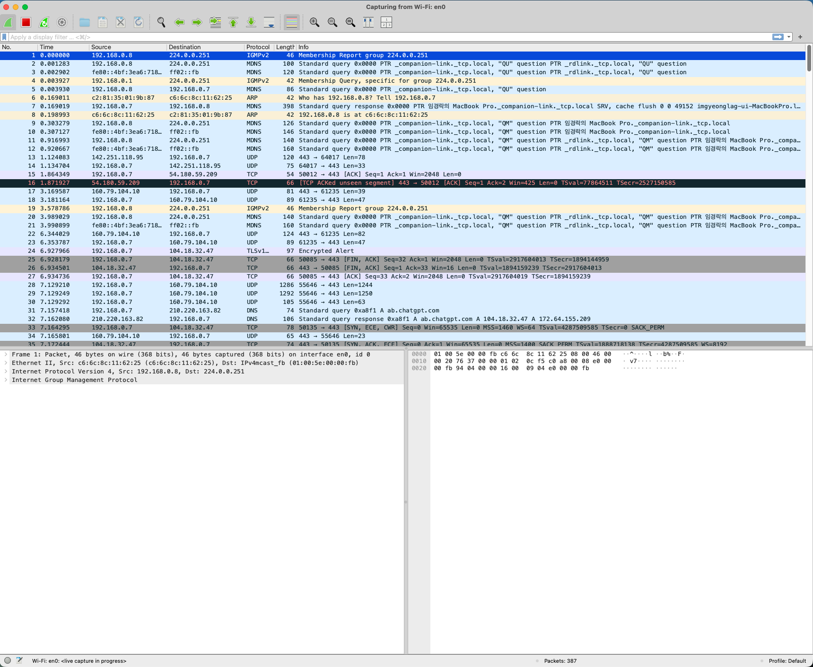

# 10주차 챌린지 - 서버 환경 세팅

## 위클리 챌린지 로드맵

위클리 챌린지 로드맵
| 순서 | 무엇을 | 왜 | 산출물 |
| --- | --- | --- | --- |
| 1 | 프로세스(process) / 스레드(thread) / 메모리 개념 정리 (`ps`, `top`, `/proc` 구조) | 관찰 대상 지표를 먼저 정의해야 보고서 항목이 명확해짐 | 개념 정리 노트 |
| 2 | EC2 t2.micro 인스턴스 생성 및 SSH 접속 환경 구성 | 로컬이 아닌 배포 환경에서의 프로세스 상태를 관찰해야 실무 조건과 일치 | 접속 가능한 EC2 인스턴스 |
| 3 | DaySync 서버(FastAPI + uvicorn)를 EC2에 배포 후 구동 | 관찰할 실행 중인 프로세스 확보 | 실행 중인 FastAPI 서버 |
| 4 | `ps`, `top`으로 프로세스/스레드 구조 조회 (uvicorn worker 수, 자식 프로세스 등) | 과제 1의 프로세스·스레드 관찰 항목 충족 | 프로세스 트리 캡처 결과 |
| 5 | `free`, `vmstat` 등으로 메모리 사용 상태 조회 | 과제 1의 메모리 관찰 항목 충족 | 메모리 스냅샷 |
| 6 | 4~5단계 결과 기반 동작 분석 보고서 작성 | 과제 1 최종 산출물 | 프로세스/스레드/메모리 분석 보고서 |
| 7 | 로컬 Mac에 WireShark 설치 및 캡처 인터페이스(네트워크 인터페이스) 설정 | 원격(EC2) 서버 트래픽을 로컬 클라이언트에서 캡처하려면 사전 준비 필요 | WireShark 캡처 준비 완료 상태 |
| 8 | EC2 보안 그룹에서 HTTP(80)/HTTPS(443) 포트 개방 | 외부 클라이언트(로컬 Mac)가 요청을 보낼 수 있도록 경로 확보 | 포트 개방 확인 |
| 9 | 로컬 Mac에서 curl 또는 브라우저로 DaySync 서버에 HTTP/HTTPS 요청 발생 | 캡처할 실제 트래픽 생성 | 요청-응답 로그 |
| 10 | WireShark로 9단계 트래픽 캡처 및 패킷 분석 | 과제 2 최종 산출물 | pcap 캡처 파일 + 패킷 분석 노트 |
| 11 | 전체 회고 작성 | 두 과제 통합 마무리 | `RETROSPECTIVE.md` 갱신 |

## 1단계 - 개념 정리

- OS(Operating System, 운영체제): 하드웨어 자원과 사용자 프로그램 사이에서 자원을 관리하고 중재하는 소프트웨어. 핵심 역할은 아래와 같다.
  - 프로세스 관리: 실행 단위 스케줄링
  - 메모리 관리: 주소 공간 할당
  - 파일 시스템 관리: 저장 장치 추상화
  - 장치 관리: 하드웨어 제어

- 하드웨어 자원: 컴퓨터를 구성하는 물리적 구성 요소 중 "프로그램 실행"에 필요한 자원을 가리킴. OS는 이 자원을 여러 프로세스가 안전하게 나눠쓰도록 관리함.
  - CPU: 연산 처리
  - 메모리: RAM, 데이터 임시 저장
  - 디스크: 데이터 영구 저장
  - 인터페이스: 서로 다른 두 영역이 상호작용하는 경계/접점을 가리킴.
    - 네트워크: NIC, 노드-노드 접점
    - 사용자: UI, 사용자-프로그램 접점
    - 파일 시스템: 프로그램-저장장치 접점
    - API: 프로그램-프로그램 접점
    - 쉘: 사용자-커널 접점 ✅

- 사용자 프로그램(user program): 사용자가 실행하는 응용 프로그램(application)을 가리킴. 브라우저, FastAPI 서버 프로세스, ps 명령어 자체도 모두 해당됨. 이들은 하드웨어에 직접 접근하지 못하도 OS 커널을 통해서만 자원을 요청함. (ps, top 내용은 아래 따로 정리함.)

- 프로세스: OS가 실행 중인 프로그램에 부여하는 실행 단위로, 독립된 메모리 공간(주소 공간)과 고유 식별자(PID)를 할당받는다. OS 커널은 이 프로세스에 CPU 시간을 스케줄링하고, 프로세스 간 메모리 공간을 격리해 서로 침범하지 못하도록 관리한다.
  - "CPU 시간을 스케줄링한다"는 의미: CPU는 하나의 명령 흐름만 실행할 수 있는데, 실행 대기 중인 프로세스는 여러 개 존재할 수 있다. 스케줄링은 "어느 프로세스에게 CPU를 얼마동안 넘길지" 결정하는 동작이고, OS 커널이 수행한다. 스케줄링을 통해 각 프로세스는 아주 짧은 시간(time slice)씩 번갈아 CPU를 할당받아 실행되고, 이 전환은 매우 빨라서 사람 눈에는 여러 프로그램이 동시에 실행되는 것처럼 보인다.

- 스레드: 하나의 프로세스 내부에서 실행되는 더 작은 단위의 실행 흐름이다. 같은 프로세스에 속한 여러 스레드는 그 프로세스의 메모리 공간(코드, 데이터, 힙)을 공유하지만, 각자 독립된 스택(stack)과 실행 위치(레지스터, 프로그램 카운터)를 가진다. 그래서 스레드 간 전환(context switch)은 프로세스 간 전환보다 비용이 적다. 왜냐하면 메모리 공간을 다시 매핑할 필요가 없기 때문이다.

- 메모리(주기억장치, RAM): 실행 중인 프로그램의 코드와 데이터를 임시로 저장하는 하드웨어 자원. 디스크와 달리 전원이 꺼지면 휘발되지만, 접근 속도가 훨씬 빠르다. OS는 각 프로세스에 독립된 가상 주소 공간(virtual address space)을 할당해, 프로세스가 실제 물리 메모리 주소를 몰라도 자신만의 메모리 영역을 사용하는 것처럼 동작한다.

- 어떤 경우 프로세스/스레드를 사용하는가?
  - 설계자가 격리(isolation)와 공유(sharing) 중 무엇이 필요한지에 따라 선택
  - 프로세스 단위 선택: 독립된 메모리 공간이므로, 완전히 독립되어야 하는 작업일 때 사용. 한쪽의 작업이 죽어도 다른 쪽 메모리는 영향받지 않아야 하기 때문. 예시: 웹 브라우저와 워드 프로세서
  - 스레드 단위 선택: 같은 메모리 공간이므로, 같은 데이터를 여러 흐름이 동시에 다뤄야 하는 작업에 사용. 메모리(데이터)를 공유해야 협업이 되고, 프로세스 간 통신(IPC) 비용도 피할 수 있기 때문. 예시: FastAPI 서버가 여러 요청을 동시 처리하는 경우

- ps: Process Status(프로세스 상태)의 약자, 현재 시스템에서 실행 중인 프로세스의 상태를 특정 시점(snapshot) 기준으로 조회하는 명령어. PID, 실행 중인 명령어, CPU/메모리 사용률 등을 텍스트로 출력함. (반대로 top은 실시간으로 갱신하여 보여줌.)
- top의 동작 방식: 짧은 주기(기본 3초)마다 /proc의 프로세스 정보를 반복 조회해서 화면을 갱신하는 방식으로 동작한다. 매 주기마다 CPU/메모리 사용률을 다시 계산해 보여주므로 ps의 정적 스냅샷과 달리 실시간 모니터링이 가능하다.
  - top이 CPU, 메모리 사용률을 계산하는 원리
    - CPU: 두 시점 사이의 차이(delta)로 계산. 커널은 프로세스가 CPU를 사용한 누적 시간(jiffies 단위)을 `/proc/[PID]/stat`에 기록한다. 따라서 이전 주기와 현재 주기의 누적값 차이를 구하고, 이를 경과 시간(3초)로 나눠서 CPU를 몇 퍼센트 사용했는지 계산한다.
    - 메모리: 누적이 아닌 현재 시점 값이 기록된다. `/proc/[PID]/status`의 VmRSS(실제 물리 메모리 점유량)를 매 주기 그대로 읽어서 표시한다.
  - stat와 status 저장 공간이 분리된 이유 및 목록
    - stat는 "빠른 반복 파싱용", status는 "사람이 직접 확인하거나 필드명 기준으로 읽기 쉬운 용"으로 형식 분리. (같은 정보(PID, 상태, 스레드 수 등)가 양쪽에 중복 존재할 수도 있음.)
    - stat: 공백으로 구분된 한 줄짜리 숫자 필드 나열. 프로그램이 빠르게 파싱하도록 고정된 위치(position) 기반 형식으로 설계됨. (PID, 프로세스 상태, PPID(부모 PID), CPU 사용 시간(utime, stime), 스레드 수, 시작 시각 등)
    - status: key-value 형태의 사람이 읽기 쉬운(human-readable) 형식 데이터의 나열. (이름, 상태, 메모리 관련 값(VmSize, VmRSS), 스레드 수 등이 라벨과 함께 들어있음.)

- `/proc`: 실제 디스크에 저장된 파일이 아니라, 커널이 실행 중인 시스템 상태를 파일처럼 노출하는 가상 파일 시스템(virtual file system). 각 프로세스마다 PID를 이름으로 하는 디렉터리가 하나씩 생김.
  - /proc/[PID]/status, /proc/[PID]/stat: 앞서 다룬 내용.
  - /proc/[PID]/task: 해당 프로세스에 속한 모든 스레드의 하위 디렉터리, 각 스레드마다 고유 식별자(TID, Thread ID)를 이름으로 하는 디렉터리가 생성되며, 프로세스 자체의 메인 스레드는 TID가 PID와 동일하다.
  - 스레드 수 조회: `ps -eLf`, `top -H`. 내부적으론 task의 디렉터리 항목 개수를 세는 것과 동일한 원리.

- 프로세스의 상태(State): 커널이 각 프로세스를 스케줄링하기 위해 관리하는 실행 단계의 구분. `ps`의 STAT 컬럼에 문자(R, S, D, Z, T)로 표기됨.
  - STAT 칼럼: 각 프로세스의 현재 상태를 문자 코드로 보여주는 컬럼. `+`처럼 상태 뒤에 붙는 추가 기호는 "포그라운드 프로세스 그룹 소속 여부" 같은 부가 정보를 나타냄.
    - "포그라운드 프로세스 그룹 소속 여부" 같은 부가 정보의 의미: 터미널(쉘) 하나에서는 여러 프로세스가 그룹으로 묶여 실행될 수 있는데, 현재 터미널의 입력(키보드)을 직접 받을 수 있는 그룹을 포그라운드 프로세스 그룹이라 함. 반대로 백그라운드에서 실행 중인 그룹은 기호 없이 표기되며, 따로 입력을 받지 못한다.

## 2단계 - 환경 구성

- EC2 t2.micro 인스턴스 생성 및 SSH 접속 환경 구성

### 2-1. EC2 t2.micro 인스턴스 생성

(AWS 로그인 이후 콘솔에서 진행할 순서)

1. 콘솔 상단 리전(region)을 확인 (서울: ap-northeast-2 권장 — 지연 시간 낮음)
2. EC2 대시보드 → "인스턴스 시작(Launch Instance)" 클릭
3. AMI(Amazon Machine Image) 선택: "Ubuntu Server" 최신 LTS 버전 (프리 티어 사용 가능 표시 확인)
4. 인스턴스 유형: t2.micro 선택 (프리 티어 대상)
5. 키 페어(key pair) 생성: 이름 지정 후 "새 키 페어 생성" → .pem 형식 선택 → 다운로드 (이 파일은 이후 재발급 불가하므로 안전하게 보관)
6. 네트워크 설정(보안 그룹): SSH(22번 포트) 인바운드 허용 규칙이 기본 포함되어 있는지 확인 (없으면 "SSH 트래픽 허용" 체크박스 선택, 소스는 "내 IP"로 제한 권장)
7. "인스턴스 시작" 클릭 → 생성 완료까지 대기
8. 인스턴스 목록에서 퍼블릭 IPv4 주소 확인

#### 개념 학습 정리

1. 키 페어(key pair)의 역할
   - 문제 상황: EC2 인스턴스 생성 중 SSH 접속을 위한 키 페어 생성 항목을 마주했으나, 정확한 필요성을 알지 못해 진행 전 먼저 확인이 필요했음
   - 부족한 개념: 공개키/개인키가 각각 어디에 저장되고, SSH 인증 과정에서 어떻게 대조되는지
   - 알게 된 사실: AWS가 공개키는 인스턴스 내부(~/.ssh/authorized_keys)에 저장하고, 개인키(.pem)는 사용자에게 다운로드해주며, 접속 시 로컬 Mac이 개인키로 자신을 증명하고 인스턴스가 저장된 공개키와 대조해 인증한다는 점
   - 섹션: Network

2. 이름(Name)과 태그(Tag)의 관계
   - 문제 상황: 인스턴스 생성 화면 최상단에 이름과 태그 입력란이 별도로 있어 두 개념이 다른 것인지 확인이 필요했음
   - 부족한 개념: 이름과 태그가 별개 개념인지, 리소스 유형(인스턴스/볼륨/네트워크 인터페이스 등) 여러 개에 어떻게 적용되는지
   - 알게 된 사실: 이름은 사실 Name이라는 키를 가진 특수한 태그이며, 태그는 여러 리소스 유형에 개별적으로 붙일 수 있는 임의의 key-value 메타데이터라는 점
   - 섹션: 기타 (클라우드 리소스 관리)

3. 하이픈/언더스코어 명명 관례
   - 문제 상황: 키 페어 및 인스턴스 이름 작성 시 구분자를 무엇으로 쓸지 판단이 필요했음
   - 부족한 개념: AWS 리소스 명명 시 관례적으로 어떤 구분자를 쓰는지
   - 알게 된 사실: 하이픈이 관례적으로 더 흔히 쓰이며, S3 버킷 등 일부 리소스는 언더스코어 자체를 지원하지 않아 하이픈이 사실상 표준으로 자리잡았다는 점
   - 섹션: 기타 (명명 규칙)

4. 키 페어 유형(RSA vs ED25519)
   - 문제 상황: 키 페어 생성 화면에서 두 가지 유형 중 하나를 선택해야 했음
   - 부족한 개념: 두 암호화 알고리즘이 실질적으로 어떻게 다른지
   - 알게 된 사실: RSA는 범용적이며 .pem/.ppk 모두 지원하고, ED25519는 키 길이가 짧고 연산이 빠르지만 .ppk를 지원하지 않아 PuTTY 사용 시 제약이 있다는 점
   - 섹션: Network

#### 추론 검증 정리

5. 0.0.0.0/0(위치 무관) 설정이 서비스에 미치는 영향
   - 문제 상황: SSH/HTTP/HTTPS 각각에 위치 무관을 선택했을 때 실제로 어떤 일이 생기는지 확인이 필요했음
   - 추론한 내용: IP를 필터링하지 않으면 위험할 수 있으므로, 개인키가 있으면 누구든 22번 포트로 접근 가능해질 것이라 추론함
   - 검증 결과: 추론이 맞았음 — 접속 시도 자체는 누구나 가능하나, 실제 인증 통과는 개인키 소지자만 가능하다는 점까지 확인됨
   - 결론: 관리용 포트(SSH)는 IP 제한이 권장되고, 서비스용 포트(HTTP/HTTPS)는 목적상 전체 개방(0.0.0.0/0)이 맞다는 점
   - 섹션: Network

6. 체크박스 미선택 시 보안 그룹 동작
   - 문제 상황: HTTP/HTTPS만 체크하고 SSH를 체크하지 않으면 22번 포트가 어떻게 처리되는지 확인이 필요했음
   - 추론한 내용: 체크하지 않은 포트는 자동으로 0.0.0.0/0(전체 허용) 상태가 될 것이라 추론함
   - 검증 결과: 추론이 틀렸음 — 체크하지 않으면 해당 포트에 대한 인바운드 규칙 자체가 생성되지 않아 완전 차단됨
   - 결론: 보안 그룹은 명시적으로 허용한 것 외에는 전부 차단(default deny)하는 방식으로 동작한다는 점
   - 섹션: Network

7. 퍼블릭 IP와 보안 그룹의 관계
   - 문제 상황: 퍼블릭 IP를 가진 인스턴스에 외부 접근이 어떻게 통제되는지 확인이 필요했음
   - 추론한 내용: 퍼블릭 IP가 있으면 누구나 접근 가능할 것이라 추론함
   - 검증 결과: 추론이 틀렸음 — 퍼블릭 IP는 네트워크 계층(3계층)에서 도달 가능성(라우팅)만 보장하고, 실제 포트 접근 허용 여부는 보안 그룹이 별도로 결정함
   - 결론: "찾아갈 수 있는가(라우팅)"와 "들어올 수 있는가(방화벽 허용)"는 완전히 분리된 별개의 관문이라는 점
   - 섹션: Network

### 2-2. SSH 접속 환경 구성

```markdown
<!-- 1. .ssh 디렉터리 생성(.ssh 디렉터리에서 관리) -->

mkdir -p ~/.ssh

<!-- 2. 키 파일 이동 -->

mv ~/Downloads/<키파일>.pem ~/.ssh/

<!-- 3. 키 파일 권한 제한 -->

chmod 400 ~/.ssh/<키파일>.pem

<!-- 4. EC2 인스턴스 SSH 접속 -->

ssh -i ~/.ssh/<키파일>.pem ubuntu@<퍼블릭 IP>
```

#### 개념 학습 정리

1. AMI(Amazon Machine Image)의 의미
   - 문제 상황: 인스턴스 생성 화면에서 Ubuntu, Amazon Linux 등 OS 선택 항목을 "이미지"라고 부르는 이유가 궁금했음
   - 부족한 개념: "이미지"가 정확히 무엇을 가리키는지
   - 알게 된 사실: AMI는 OS 설치와 기본 구성이 끝난 상태를 스냅샷으로 저장해둔 원본(template)이며, 인스턴스는 그 이미지를 복사해 실행한 사본이라는 점
   - 섹션: OS

2. 리눅스 커널과 배포판(distribution)의 관계
   - 문제 상황: "리눅스 환경인데 왜 Ubuntu라는 다른 이름의 OS를 쓰는가"라는 의문이 들었음
   - 부족한 개념: 커널과 배포판이 서로 다른 계층의 개념이라는 점
   - 알게 된 사실: Linux는 커널만 가리키고, 그 위에 패키지 관리자·기본 도구를 얹어 완성한 것이 배포판(Ubuntu, Red Hat 등)이라는 점
   - 섹션: OS

3. 배포판이 여러 종류로 나뉜 근본 이유
   - 문제 상황: 하드웨어 회사별 최적화 때문에 배포판이 여러 개 생긴 것인지 궁금했음
   - 부족한 개념: 배포판 분화의 실제 원인
   - 알게 된 사실: 오픈소스 라이선스로 누구나 재조합할 수 있었기 때문에, 패키지 관리 방식·사용 목적·지원 모델·릴리스 주기 등 목적에 따라 여러 배포판이 갈라졌다는 점
   - 섹션: OS

4. Debian 계열 / Fedora-RHEL 계열 구분
   - 문제 상황: "Debian 계열 기반", "Fedora/RHEL 계열 기반"이라는 표현이 커널 설명과 별개로 존재하는 이유가 궁금했음
   - 부족한 개념: 배포판 사이에도 계보(lineage)가 있다는 점
   - 알게 된 사실: 커널 위에 얹는 패키지 관리 체계(apt/.deb vs yum/.rpm)를 물려받은 그룹으로 배포판이 다시 나뉜다는 점, 이 계보가 패키지 설치 명령어·트러블슈팅 자료 검색 범위에 실무적으로 영향을 준다는 점
   - 섹션: OS

5. .pem 파일 관리 관행
   - 문제 상황: 다운로드 디렉터리에 있는 .pem 파일을 어떻게 관리해야 하는지 궁금했음
   - 부족한 개념: 개발자가 일반적으로 키 파일을 두는 위치와 권한 설정 방식
   - 알게 된 사실: ~/.ssh/에 모아 chmod 400으로 권한 제한하고, .gitignore로 버전 관리에서 제외하며, ~/.ssh/config로 접속 별칭을 등록하는 관행이 있다는 점
   - 섹션: Network

6. .ssh 디렉터리 확인 및 OS 내장 명령어 여부
   - 문제 상황: .ssh가 제대로 생성됐는지 확인하는 방법과, 이런 명령어들이 별도 설치가 필요한지 궁금했음
   - 부족한 개념: 숨김 파일 조회 명령어, OS 기본 내장 명령어와 별도 설치 도구의 차이
   - 알게 된 사실: ls -la로 숨김 항목까지 확인 가능하며, ls/mkdir/mv/chmod 등은 git과 달리 OS(coreutils)에 기본 내장되어 별도 설치가 필요 없다는 점
   - 섹션: OS

7. SSH 최초 접속 시 host key 인증 메시지의 의미
   - 문제 상황: 접속 시 "authenticity of host ... can't be established" 메시지가 떠서 무엇을 묻는 것인지 확인이 필요했음
   - 부족한 개념: 서버 쪽 호스트 키(host key)와 known_hosts 파일의 역할
   - 알게 된 사실: 서버도 고유 호스트 키를 가지며, 최초 접속 시 이를 신뢰할지 확인받고 yes 입력 시 known_hosts에 저장돼 이후 접속부터 대조를 생략한다는 점
   - 섹션: Network

8. 보안 그룹 "내 IP" 갱신 필요성
   - 문제 상황: 집으로 이동 후 SSH 접속 시 Operation timed out 에러가 발생해, 등록된 인바운드 규칙의 소스 IP가 문제일 가능성을 확인해야 했음
   - 부족한 개념: 보안 그룹 소스 설정 화면에서 현재 접속 위치의 IP를 어떻게 다시 지정하는지
   - 알게 된 사실: 소스 입력창에 뜨는 CIDR 자동완성 목록에서 직접 값을 찾는 게 아니라, "소스 유형" 드롭다운에서 "내 IP(My IP)"를 선택하면 AWS가 현재 브라우저의 발신 IP를 자동 감지해 채워준다는 점 — 네트워크 위치가 바뀔 때마다 이 방식으로 갱신해야 한다는 점
   - 섹션: Network

#### 추론 검증 정리

9. AWS 인스턴스 개수와 IPv4 주소 공간의 관계
   - 문제 상황: 인터넷 게이트웨이의 NAT 매핑 원리를 배운 뒤, AWS가 관리 가능한 인스턴스 수를 IP 주소 공간과 연결 지어 추측함
   - 추론한 내용: AWS 인스턴스가 255⁴개 존재하고, 그만큼의 물리 서버가 있을 것이라 추론함
   - 검증 결과: 추론이 틀렸음 — 각 옥텟은 256개 값(255가 아님)이고, 모든 인스턴스가 퍼블릭 IP를 갖는 것도 아니며, 사설 IP는 VPC마다 독립적으로 재사용되므로 "물리 서버 수 = IP 개수"라는 등식 자체가 성립하지 않음
   - 결론: 퍼블릭 IP 공간(약 43억 개)은 전 세계가 공유하고, 사설 IP는 VPC별로 격리되어 반복 사용되며, 물리 서버 한 대 위에 가상화로 여러 인스턴스가 동시에 존재한다는 점
   - 섹션: Network

10. SSH 명령어와 현재 작업 디렉터리의 관계
    - 문제 상황: ssh -i <키파일>.pem ...처럼 경로 없이 파일명만 쓴 명령어가 어떤 조건에서 동작하는지 확인이 필요했음
    - 추론한 내용: 이 명령어는 .pem 파일이 루트(root, /) 디렉터리에 있을 때만 가능한 것이라 추론함
    - 검증 결과: 추론이 틀렸음 — 루트가 아니라 "현재 작업 디렉터리(current working directory)"와 파일 위치가 일치할 때 상대 경로로 동작함
    - 결론: 경로 없이 파일명만 쓰면 셸이 항상 현재 작업 디렉터리를 기준으로 상대 경로를 해석한다는 점
    - 섹션: OS

11. ~ 기호가 가리키는 대상
    - 문제 상황: 터미널에서 /Users/imgyeonglak이 표시되는 것을 보고 ~의 의미를 확인이 필요했음
    - 추론한 내용: ~가 루트(root)를 가리키고, ~/.ssh는 "루트 아래 .ssh를 만든다"는 뜻이라 추론함
    - 검증 결과: 추론이 틀렸음 — ~는 루트가 아니라 현재 로그인한 사용자의 홈 디렉터리를 가리키는 기호이며, 사용자마다 다른 절대 경로(/Users/imgyeonglak, /home/ubuntu 등)로 해석됨
    - 결론: 루트(/)는 파일 시스템 전체의 최상위이고, 홈 디렉터리(~)는 특정 사용자에게 할당된 개인 작업 공간이라는 점 — 서로 다른 개념
    - 섹션: OS

## 3단계 - 프로젝트 구동

### 개념 학습 정리

- 문제 상황: 8000번 포트 인바운드 규칙 미비로 인한 크롬 접근 불가
  - uvicorn 서버는 정상 실행되었으나, 크롬에서 퍼블릭 IP:8000 접속 시 "사이트에 연결할 수 없음" 발생
- 부족한 개념: 퍼블릭 IP를 통한 접근 시 보안 그룹의 인바운드 규칙이 포트 단위로 별도 적용된다는 점, 그리고 SSH(22번)만 허용된 상태에서는 다른 포트(8000번)로의 접근이 원천 차단된다는 점
- 알게 된 사실:
  - SSH 개념 정리: SSH는 GitHub에서 쓰는 것과 EC2 접속에 쓰는 것이 동일한 프로토콜(공개키/개인키 기반 인증)이며, .pem 파일은 AWS가 발급한 키 형태일 뿐 핵심은 공개키/개인키 인증 원리라는 점. SSH(원격 제어)와 HTTP/HTTPS(콘텐츠 전달)는 목적 자체가 다른 별개의 프로토콜이라는 점
  - Network 기반 개념 정리: 크롬 요청이 로컬 OS의 네트워크 스택에서 TCP/IP 4계층 기준으로 캡슐화되어 IP 헤더(출발지/목적지 주소)와 TCP 헤더(포트)가 채워지고, 보안 그룹은 이 겉면의 헤더 값만 확인해 통과 여부를 결정하며(HTTP header/body 내용은 보지 않음), 이 필터링과 NAT(퍼블릭 IP ↔ 사설 IP 변환)가 AWS 경계(인터넷 게이트웨이)에서 함께 처리된다는 점. 인바운드 규칙에 "사용자 지정 TCP", 포트 8000, 소스 "내 IP"를 추가해야 서비스 포트 접근이 가능하다는 점
- 섹션: Network

## 4단계 - 관찰 항목 조회 1

### 전체 관찰 항목

1. 유휴 상태 vs 요청 처리 중 상태 비교
2. 동시 요청 부하에 따른 스레드/프로세스 변화
3. `top`의 실시간 갱신 체감
4. uvicorn worker 개수 변화 실험

#### 관찰 1 - 유휴 상태 vs 요청 처리 시 프로세스/스레드 변화

##### 목적

- `ps`로 uvicorn 서버의 프로세스/스레드 구조를 조회하고, 요청 처리 여부에 따라 스레드 수(NLWP)와 CPU 사용률이 실제로 어떻게 달라지는지 확인

##### 환경

- 인스턴스: c7i.flex.large (2 vCPU, 4GiB)
- 서버: `uv run uvicorn main:app --host 0.0.0.0 --port 8000` (DaySync, Qwen2.5-1.5B GGUF 백엔드)
- 관찰 방법: 별도 SSH 세션에서 `ps -o pid,nlwp,pcpu,time -p <PID>`로 0.2초 간격 반복 조회

##### 유휴 상태 vs 요청 처리 시 변화

| 상태                       | NLWP | %CPU | TIME     |
| -------------------------- | ---- | ---- | -------- |
| 유휴 상태                  | 14   | 1.8  | 00:00:21 |
| `POST /query` 요청 처리 중 | 14   | 2.5  | 00:00:29 |

- `POST /query`로 실제 질문(`{"question": "다음 주 일정 알려줘"}`)을 보내며 요청 처리 구간을 관찰
- NLWP는 유휴 상태와 요청 처리 중 모두 14로 동일 — 변화 없음
- 반면 `%CPU`(1.8 → 2.5)와 `TIME`(누적 CPU 시간, 8초 증가)은 요청 처리 구간에서 뚜렷하게 상승

##### 분석 내용

- 스레드 수(NLWP)는 프로세스 시작 시점에 고정되며, 요청 유무와 무관하게 유지됨
- 실제로 요청 처리 여부를 나타내는 지표는 NLWP가 아니라 `%CPU`(순간 사용률)와 `TIME`(누적 CPU 시간)의 증가임
- 스레드 풀은 torch 등 라이브러리가 프로세스 시작 시 CPU 연산 병렬화를 위해 미리 생성해두고, 이후 요청마다 재사용하는 구조로 추정됨 (요청마다 새로 생성·소멸하는 방식이 아님)

#### 관찰 2 - 동시 요청 부하에 따른 스레드/프로세스 변화

##### 목적

- 여러 요청을 동시에 보냈을 때 스레드 수(NLWP)와 프로세스 상태가 어떻게 변하는지 확인

##### 환경

- 인스턴스: c7i.flex.large (2 vCPU, 4GiB)
- 서버: `uv run uvicorn main:app --host 0.0.0.0 --port 8000`
- 관찰 방법: 세션 2에서 `ps -o pid,nlwp,pcpu,time -p <PID>` 0.2초 간격 반복 조회, 세션 3에서 `POST /query` 요청 5개 동시 전송

##### 동시 요청 시 변화 및 서버 크래시

| 시점              | NLWP                          |
| ----------------- | ----------------------------- |
| 요청 전 (유휴)    | 14                            |
| 동시 요청 처리 중 | 18 → 21                       |
| 크래시 직후       | 프로세스 조회 불가 (PID 소멸) |

- 세션 3에서 동일한 요청 5개를 동시에 전송 → 세션 2 관찰 결과 NLWP가 14 → 18 → 21로 상승 (요청 처리를 위해 스레드 풀이 확장됨)
- 직후 세션 3의 curl 요청들이 `Empty reply from server` (exit 52)로 실패, 세션 1(서버 로그)에서 `free(): invalid size` 발생 후 프로세스 크래시 확인
- `sudo journalctl -k | grep -i "out of memory\|killed process"` 결과 없음 — OOM Kill이 아님을 확인

##### 분석 내용

- `free(): invalid size`는 OOM이 아니라 메모리 손상(heap corruption) 에러 — glibc 메모리 할당기가 손상된 메모리 블록을 감지하고 프로세스를 강제 종료시킨 것
- 크래시 직전 서버 로그에 `Llama.generate: 170 prefix-match hit, remaining 128 prompt tokens to eval`가 동일하게 4회 연속 출력됨 — 동시에 들어온 여러 요청이 거의 같은 순간에 `Llama.generate()`를 호출했다는 뜻
- `llama-cpp-python`이 감싸는 llama.cpp의 추론 컨텍스트(모델의 KV 캐시를 포함)는 스레드 안전(thread-safe)하게 설계되어 있지 않음 — 여러 요청이 동시에 같은 컨텍스트에 접근해 KV 캐시를 읽고 쓰면 메모리 영역이 충돌(race condition)하여 손상됨
- 결론: 동시 요청 시 uvicorn은 워커 스레드를 늘려 병렬 처리를 시도하지만, 단일 llama.cpp 컨텍스트를 공유하는 현재 구조에서는 동시 요청을 안전하게 처리할 수 없어 서버 전체가 크래시됨 — 요청을 순차 처리하도록 제한(락/세마포어)하거나 요청별로 컨텍스트를 분리하는 조치가 필요함 (해결은 별도 과제로 남김)

#### 관찰 3 - `top`의 실시간 갱신 체감

##### 목적

- `top -H`로 서버 프로세스를 실시간 관찰하며, 요청 처리 시 스레드 수와 CPU 사용률이 어떻게 변하는지 직접 확인

##### 환경

- 인스턴스: c7i.flex.large (2 vCPU, 4GiB)
- 관찰 방법: `top -H -p <PID>`로 uvicorn 서버(스레드 단위) 실시간 관찰, 별도 세션에서 `POST /query` 요청 1개 전송

##### 유휴 상태 vs 요청 처리 시 변화

| 상태         | Threads(total) | %Cpu(s)          | 비고                                                |
| ------------ | -------------- | ---------------- | --------------------------------------------------- |
| 유휴 상태    | 12             | 100.0 id         | 모든 스레드 %CPU 0.0~0.3                            |
| 요청 처리 중 | 14             | 97.0 us / 2.8 id | 새 스레드 2개(PID 3178, 3179)가 각각 96.7% CPU 사용 |

##### 분석 내용

- 요청이 들어오는 순간 스레드 수가 12 → 14로 실시간 증가하는 것을 직접 확인 — 새로 생긴 두 스레드가 실제 추론 연산을 담당
- 기존 스레드(12개)는 요청 처리 중에도 계속 0.0% 유휴 상태 유지
- 관찰 1에서 내린 "스레드 수는 고정되고 변하지 않는다"는 결론은 정확하지 않았음 — 관찰 1은 이미 서버가 특정 요청을 처리한 이후의 스레드 수(12 또는 14)로 시작했기 때문에 변화 시점을 놓쳤을 가능성이 있음. `top`처럼 실시간 갱신되는 도구로 관찰해야만 이 순간을 포착할 수 있었음
- 새로 생성되는 스레드(PID 3178, 3179)가 정확히 무엇인지(llama.cpp의 스레드 풀 설정, `n_threads` 파라미터와의 관계)는 확인이 더 필요함 (별도 과제로 남김)

#### 관찰 4 - uvicorn worker 개수 변화 실험

##### 목적

- `--workers` 옵션으로 worker 수를 지정했을 때, 실제 프로세스 트리(부모-자식 uvicorn 프로세스 개수)가 어떻게 구성되는지 확인

##### 환경

- 인스턴스: c7i.flex.large (2 vCPU, 4GiB)
- 서버: `uv run uvicorn main:app --host 0.0.0.0 --port 8000 --workers 2`
- 관찰 방법: `ps -eLf`, `pstree -p`, `ps -o pid,ppid,nlwp,pcpu,cmd -p <PID>`, `free -h`

##### worker 2개 실행 시 프로세스 구조 및 메모리 사용

```
uv(3193)
└─ uvicorn(3196) — master process, NLWP=1
   ├─ python3(3197) — multiprocessing.resource_tracker (보조 프로세스), NLWP=1
   ├─ python3(3198) — 워커 1, NLWP=9, %CPU 1.8
   └─ python3(3199) — 워커 2, NLWP=9, %CPU 1.8
```

- `free -h`: 총 3.7GiB 중 3.2GiB 사용, 197MiB만 여유 — 워커 2개가 Qwen GGUF 모델을 각자 독립적으로 중복 로드했기 때문
- `sudo journalctl -k | grep -i "out of memory\|killed process"` 결과 없음 — 메모리가 거의 소진됐지만 아직 OOM Kill은 발생하지 않음

##### 분석 내용

- `--workers 2` 지정 시 uvicorn master(3196) 아래로 실제 요청을 처리하는 워커 프로세스 2개(3198, 3199)가 별도 자식 프로세스로 생성되며, 각 워커는 독립된 메모리 공간에 모델을 중복으로 로드함
- 관찰 과정에서 `ps -eLf | grep uvicorn`으로는 워커 프로세스가 전혀 검색되지 않는 함정을 발견함 — 워커 프로세스의 실제 커맨드라인이 원래 실행 명령(`uvicorn main:app ...`)이 아니라 Python `multiprocessing` 모듈의 내부 부트스트랩 함수 호출(`python3 -c "from multiprocessing.spawn import spawn_main; ..."`)로 대체되어 표시되기 때문
- `pstree -p`와 PID를 직접 지정한 `ps -o` 조회로만 워커 프로세스를 정확히 확인할 수 있었음 — 프로세스 관찰 시 `grep` 필터링이 실행 명령어 문자열에 의존하는 한계를 가진다는 점을 확인
- worker 수를 늘리면 처리 용량은 늘어날 수 있으나, 모델이 워커마다 중복 로드되어 메모리 사용량이 워커 수에 비례해 증가함 — 메모리가 제한적인 환경(4GiB)에서는 worker 수 증가가 오히려 OOM 위험을 높일 수 있음

## 5단계 - 관찰 항목 조회 2

### 관찰 목적

- `free`, `vmstat`으로 서버 인스턴스의 메모리 사용 상태를 스냅샷으로 남김

### 관찰 환경

- 인스턴스: c7i.flex.large (2 vCPU, 4GiB)
- 서버 상태: `uv run uvicorn main:app --host 0.0.0.0 --port 8000 --workers 2` 실행 중 (워커 2개, 유휴 상태)
- 관찰 방법: `free -h`, `vmstat 1 5` (1초 간격 5회 반복)

### 메모리 스냅샷

#### `free -h`

```
               total        used        free      shared  buff/cache   available
Mem:           3.7Gi       3.2Gi       191Mi       2.9Mi       564Mi       512Mi
Swap:             0B          0B          0B
```

#### `vmstat 1 5`

```
procs -----------memory---------- ---swap-- -----io---- -system-- -------cpu-------
 r  b   swpd   free   buff  cache   si   so    bi    bo   in   cs us sy id wa st gu
 0  0      0 195676   3752 574684    0    0   449    10  141    0  1  0 99  0  0  0
 0  0      0 195676   3752 574724    0    0     0     0  352  214  1  0 100  0  0  0
 0  0      0 195676   3752 574724    0    0     0     0  347  211  0  0 100  0  0  0
 0  0      0 195676   3752 574724    0    0     0     0  253  169  1  0 100  0  0  0
 0  0      0 195676   3752 574724    0    0     0     0  105  104  0  1 100  0  0  0
```

### 분석 내용

- 총 3.7GiB 중 3.2GiB(약 87%) 사용, 여유 191MiB — 워커 2개(4단계 관찰)가 Qwen GGUF 모델을 각자 독립적으로 로드한 상태가 그대로 유지됨
- `Swap: 0B` — 이 인스턴스에는 스왑이 구성되어 있지 않음
- `vmstat`의 `swpd`, `si`, `so` 모두 0으로 5초 내내 고정 — 스왑 활동이 전혀 없음
- `free`(여유 메모리)가 195,676KB로 5회 조회 동안 변동 없음 — 요청이 없는 유휴 상태라 메모리 사용량이 안정적으로 유지됨
- `us`(사용자 모드) 0~1%, `id`(유휴) 99~100% — CPU도 거의 쉬고 있는 상태
- 첫 줄에만 `bi`(블록 인) 449가 찍히고 이후 0으로 안정 — `vmstat` 실행 시점의 일시적 디스크 읽기 활동으로 추정, 이후 영향 없음

### 인사이트

- 4GiB 인스턴스에서 워커 2개 구성만으로 이미 가용 메모리의 87%를 점유하고 있어, 실제 요청이 들어올 경우 남은 여유(191MiB)만으로는 부족할 가능성이 높음
- 스왑이 구성되어 있지 않은 상태이므로, 이 여유가 소진되면 스왑으로 완충되지 않고 곧바로 OOM Kill로 이어질 것으로 예상됨 (3단계 트러블슈팅 5차 시도에서 스왑 1GiB로도 OOM을 막지 못했던 사례와 비교하면, 스왑이 아예 없는 지금 상태는 더 취약한 조건)
- 이 스냅샷은 워커 2개·유휴 상태 기준이며, 실제 서비스 운영 시에는 워커 수와 메모리 여유의 트레이드오프를 사전에 고려해야 함을 뒷받침하는 근거 자료로 활용 가능

## 6단계 - 항목 분석 보고서 작성

### 1. 개요

- 대상: DaySync 서버 (FastAPI + uvicorn, Qwen2.5-1.5B GGUF 백엔드)
- 인스턴스: c7i.flex.large (2 vCPU, 4GiB 메모리)
- 목적: 4단계(프로세스/스레드 구조 관찰) 및 5단계(메모리 사용 상태 조회) 결과를 종합해, 서버의 실제 동작 방식과 그로부터 확인된 문제점을 정리

### 2. 프로세스 구조

단일 워커로 실행할 경우, 프로세스 계층은 다음과 같다.

```
uv(래퍼) → uvicorn(실제 서버 프로세스)
```

`--workers 2`로 실행할 경우, master process 아래 워커가 자식 프로세스로 분리된다.

```
uv(래퍼)
└─ uvicorn(master process)
   ├─ multiprocessing.resource_tracker (보조 프로세스)
   ├─ 워커 1 (자식 프로세스)
   └─ 워커 2 (자식 프로세스)
```

각 워커는 독립된 메모리 공간을 가지며, Qwen GGUF 모델을 각자 별도로 로드한다. 즉 워커 수만큼 모델이 중복 적재된다. 관찰 과정에서 워커 프로세스의 실제 커맨드라인이 `uvicorn main:app ...`이 아니라 Python `multiprocessing` 모듈의 내부 함수 호출(`spawn_main`)로 표시된다는 점을 확인했으며, 이 때문에 `ps ... | grep uvicorn` 방식으로는 워커 프로세스가 검색되지 않는 관찰상의 함정이 있었다.

### 3. 스레드 동작

- 스레드 수(NLWP)는 프로세스 시작 시점 기준으로 고정되지 않고, 유휴 상태에서도 12~14개 수준을 유지하다가 요청이 들어오는 순간 추가로 증가하는 것이 `top -H` 실시간 관찰로 확인됨(12 → 14).
- 새로 생성된 스레드가 실제 추론 연산(%CPU 96%대)을 전담하고, 기존 스레드는 계속 유휴 상태(0.0%)를 유지함 — 즉 스레드 풀 전체가 균등하게 일하는 게 아니라, 요청 처리 시점에만 일부 스레드가 집중적으로 동원되는 구조.
- 정적인 `ps` 스냅샷 조회만으로는 이 순간을 놓치기 쉬우며, `top`처럼 실시간 갱신되는 도구로 관찰해야 정확한 동작을 포착할 수 있음이 확인됨.
- **중요 발견**: 동시 요청(5개)을 보냈을 때 스레드 수가 14 → 21로 증가했으나, 그 직후 서버가 `free(): invalid size`(메모리 손상)로 크래시했다. 원인은 `llama-cpp-python`이 감싸는 llama.cpp 추론 컨텍스트가 스레드 안전(thread-safe)하지 않아, 여러 요청이 동시에 같은 KV 캐시에 접근하며 메모리 영역이 충돌했기 때문으로 규명됨.

### 4. 메모리 사용 현황

- 단일 워커·유휴 상태에서는 메모리 사용량이 안정적이나, 워커 2개 구성 시 4GiB 중 3.2GiB(약 87%)를 이미 점유하는 것으로 확인됨(모델 중복 로드가 원인)
- `vmstat` 관찰 결과 스왑 활동(`si`/`so`)은 0으로, 현재 인스턴스에는 스왑이 구성되어 있지 않음.
- 이전 3단계 트러블슈팅(메모리 및 디스크 부족)에서는 t3.micro(1GiB) 환경에서 스왑 1GiB를 추가해도 OOM을 막지 못했던 사례가 있었는데, 지금 c7i.flex.large(4GiB)는 스왑조차 없는 상태이므로, 여유 메모리(191MiB)가 소진되면 곧바로 OOM Kill로 이어질 가능성이 높음.

### 5. 종합 인사이트

- **동시성 처리의 구조적 한계**: uvicorn(애플리케이션 서버) 계층은 동시 요청 시 스레드를 늘려 병렬 처리를 시도하지만, 그 아래 llama.cpp 추론 엔진 계층은 단일 컨텍스트를 여러 스레드가 공유하는 구조라 동시 요청을 안전하게 처리하지 못한다. 서버 계층의 동시성 대응과 모델 엔진 계층의 동시성 안전성은 별개이며, 상위 계층이 병렬성을 확보했다고 하위 계층까지 안전이 보장되지는 않는다는 것을 실제로 확인함.
- **워커 수와 메모리의 트레이드오프**: worker 수를 늘리면 처리 용량은 늘어나지만, 모델이 워커마다 중복 로드되어 메모리 사용량이 워커 수에 비례해 증가한다. 메모리가 제한적인 환경에서는 worker 수 증가가 처리 능력 향상보다 오히려 OOM 위험 증가로 이어질 수 있다.
- **관찰 도구의 한계 인지**: `ps` 같은 정적 스냅샷 도구는 특정 순간만 포착하므로, 실시간으로 변하는 스레드/프로세스 상태를 놓칠 수 있다. `top -H`처럼 실시간 갱신되는 도구와 병행해야 정확한 동작을 파악할 수 있다는 것을 여러 차례 확인함(스레드 수 실시간 증가, 워커 프로세스 검색 누락 등)
- **다음 과제로 남긴 문제**: 동시 요청 시 서버 크래시(`free(): invalid size`)에 대한 실질적 해결(요청 순차 처리를 위한 락/세마포어 적용, 또는 요청별 컨텍스트 분리)은 이번 관찰 범위에서 다루지 않고 별도 과제로 남김.

## 7단계 - WireShark 설치 및 캡처 인터페이스 설정

- `brew install --cask wireshark` (설치 과정에서 ChmodBPF 설치 필수 — 관리자 권한 없이 패킷 캡처를 허용하는 헬퍼)
- 활성 네트워크 인터페이스 확인: `route get default | grep interface` → `en0`(Wi-Fi) 확인
- Wireshark 실행 후 `en0` 인터페이스 선택, 정상적으로 실시간 캡처(mDNS, ARP, DNS, TLS 등 배경 트래픽) 확인 완료



## 8단계 - 외부 접근 개방 (리버스 프록시 구성)

### 결정 사항

- 로드맵 원안은 HTTP(80)/HTTPS(443) 직접 개방이었으나, 실무 관례에 따라 nginx 리버스 프록시를 앞단에 두는 방식으로 변경
- HTTPS는 인증서(도메인 필요) 발급이 이번 챌린지 범위를 벗어나 제외 — HTTP(80)만 구성

### 진행 과정

- `sudo apt install -y nginx` 설치
- `/etc/nginx/sites-available/daysync` 설정 생성: 80번 포트 요청을 `proxy_pass`로 `127.0.0.1:8000`(uvicorn)에 전달
- `sudo ln -s .../sites-available/daysync .../sites-enabled/`로 설정 활성화
- 기본 설정(`sites-enabled/default`)과 `server_name` 충돌 경고 확인 → 심볼릭 링크만 제거(원본은 `sites-available`에 보존됨)하여 해결
- `sudo systemctl restart nginx` → `active (running)` 확인, master process 1개 + worker process 2개 구조로 실행됨을 확인
- AWS 보안 그룹: 80번 포트(HTTP) 인바운드 규칙 추가, 8000번 포트는 규칙에서 제거(또는 "내 IP" 제한)해 nginx를 거치지 않은 직접 접근 차단
- 크롬에서 포트 번호 없이 `http://<퍼블릭 IP>` 접속 → DaySync 응답 정상 확인

### 인사이트

- 리버스 프록시가 표준 포트 매핑, TLS 처리 분리, 다중 서비스 통합, 보안 경계 구분의 역할을 한다는 걸 실습으로 확인
- `sites-available`/`sites-enabled` 구조가 "설정 원본 보관"과 "활성화 여부 표시"를 분리해, 설정을 지우지 않고도 안전하게 켜고 끌 수 있게 해준다는 점을 확인

## 9단계 - 트래픽 및 패킷 분석 보고서 작성

### 목적

- 로컬 Mac에서 DaySync 서버(EC2, nginx 리버스 프록시 경유)로 HTTP 요청을 보내고, WireShark로 전체 요청-응답 사이클을 캡처해 프로토콜 계층 구조를 실제로 확인

### 환경

- 로컬: Mac (Wi-Fi, 인터페이스 `en0`, 사설 IP `192.168.0.7`)
- 서버: EC2 (퍼블릭 IP `3.38.221.167`), nginx가 80번 포트를 8000번(uvicorn)으로 프록시
- 캡처 필터: `ip.addr == 3.38.221.167`
- 테스트 요청: `curl -X POST http://3.38.221.167/query -H "Content-Type: application/json" -d '{"question": "다음 주 일정 알려줘"}'`

### 캡처된 패킷 흐름

패킷 흐름표
| 패킷 | 내용 |
| --- | --- |
| 576~578 | TCP 3-way handshake (SYN, SYN-ACK, ACK) — 80번 포트 연결 수립 |
| 579 | `POST /query HTTP/1.1`, JSON body 전송 |
| 580 | 서버 수신 확인(ACK) |
| (631, 634, 636) | SSH 세션의 keepalive 패킷 — curl 요청과 무관한 별개 트래픽 |
| 632~633 사이 | 약 8.4초 공백 — 서버 측 임베딩 검색 및 LLM 추론 처리 시간 |
| 633 | `HTTP/1.1 200 OK`, JSON 응답 수신 |
| 635 | 응답 수신 확인(ACK) |
| 637~639 | TCP 연결 종료(FIN, ACK) |

### 페이로드 상세 (계층별 캡슐화 확인)

**패킷 579 (요청)**

```
Ethernet II        Src: c2:81:35:01:9b:87 (로컬 Mac Wi-Fi MAC), Dst: EFMNetworks_cd:e2:28 (공유기)
Internet Protocol  Src: 192.168.0.7, Dst: 3.38.221.167
TCP                Src Port: 50284, Dst Port: 80
HTTP               POST /query HTTP/1.1
JSON               {"question": "다음 주 일정 알려줘"}
```

**패킷 633 (응답)**

```
Ethernet II        Src/Dst가 요청과 반대로 뒤바뀜
Internet Protocol  Src: 3.38.221.167, Dst: 192.168.0.7
TCP                Src Port: 80, Dst Port: 50284
HTTP               200 OK
JSON               {"answer": "주어진 문서에서 답을 찾을 수 없습니다.", "retrieved_chunks": [...]}
```

### 분석 내용

- 가장 안쪽(JSON, 실제 데이터) → HTTP(응용 계층 헤더) → TCP(포트) → IP(출발지/목적지 주소) → Ethernet(MAC 주소) 순으로 겹겹이 캡슐화된 구조가 실제 패킷에서 그대로 확인됨 — 이전에 개념으로만 다뤘던 캡슐화/디캡슐화가 실제 관찰로 검증됨
- HTTP(암호화 없음)로 구성했기 때문에 질문 내용과 응답 JSON 전체가 평문으로 노출됨 — HTTPS였다면 이 구간은 `Transport Layer Security` 계층으로만 보이고 내부 내용은 암호화되어 확인 불가능했을 것
- 요청(579)과 응답(633) 사이 약 8.4초 지연은 4단계 관찰에서 확인한 "요청 처리 시 CPU/스레드가 실제로 동작하는 시간"과 대응되며, 패킷 캡처에서는 이 시간이 서버의 "응답 없는 침묵 구간"으로 나타남
- SSH 트래픽이 필터링된 결과에 함께 섞여 있는 것은, 같은 목적지 IP(EC2)로 열려 있는 별도 SSH 세션의 keepalive 신호로, curl 요청 자체와는 무관함

### 추가로 테스트해볼 만한 항목

1. **HTTP vs HTTPS 비교**: 같은 요청을 HTTPS(443, 인증서 발급 후)로도 보내, Wireshark에서 페이로드가 `TLS`로만 보이고 내용이 감춰지는지 직접 대조 — HTTP의 노출 위험을 시각적으로 확인 가능
2. **8000번 포트 직접 접근 차단 확인**: 보안 그룹에서 8000번을 제거한 뒤 `curl http://3.38.221.167:8000/query`를 시도해, 실제로 연결 자체가 거부(타임아웃 또는 connection refused)되는지 확인 — nginx 우회 접근이 실제로 막혔는지 검증
3. **동시 요청 시 패킷 캡처**: 3단계 트러블슈팅에서 확인했던 동시 요청 크래시(`free(): invalid size`) 상황을 재현하며 캡처하면, 서버가 응답 없이 연결을 강제로 끊는 패킷(RST)이 잡히는지 확인 가능
4. **응답 지연과 스레드 활동 동시 관찰**: curl 요청과 동시에 `top -H`를 띄워, Wireshark의 침묵 구간(패킷 632~633 사이)과 실제 스레드 CPU 사용률 급증 시점이 정확히 일치하는지 시간 축으로 대조

## 10단계 - 전체 회고 작성

### 최종 인사이트

- (기술) 문제는 계층마다 다른 얼굴로 나타난다는 걸 확인했다. 같은 "서버가 안 된다"는 증상도 디스크 부족, ABI 불일치, OOM, 보안 그룹 미비, 컨텍스트 공유 충돌처럼 원인이 계층별로 완전히 달랐고, 매번 그 계층을 정확히 좁혀가는 과정이 필요해 경험을 쌓아볼 수 있었다.
- (기술) uvicorn이 동시 요청에 스레드를 늘려 대응해도, 그 아래 llama.cpp 엔진이 스레드 안전하지 않으면 결국 크래시로 이어졌다. 상위 계층의 대응이 하위 계층의 안전까지 보장하지 않는다는 걸 실제로 경험할 수 있었다.
- (도구/관찰) 이론(캡슐화, NAT, 보안 그룹 필터링)으로 배운 내용을 WireShark 패킷 하나하나로 직접 확인하면서, 개념과 실측이 어떻게 맞물리는지 눈으로 검증할 수 있었다.
- (다음 과제) 이번에 발견했지만 해결하지 않은 문제(동시 요청 크래시, HTTPS 인증서 구성)는 다음 학습 과제로 남긴다.
