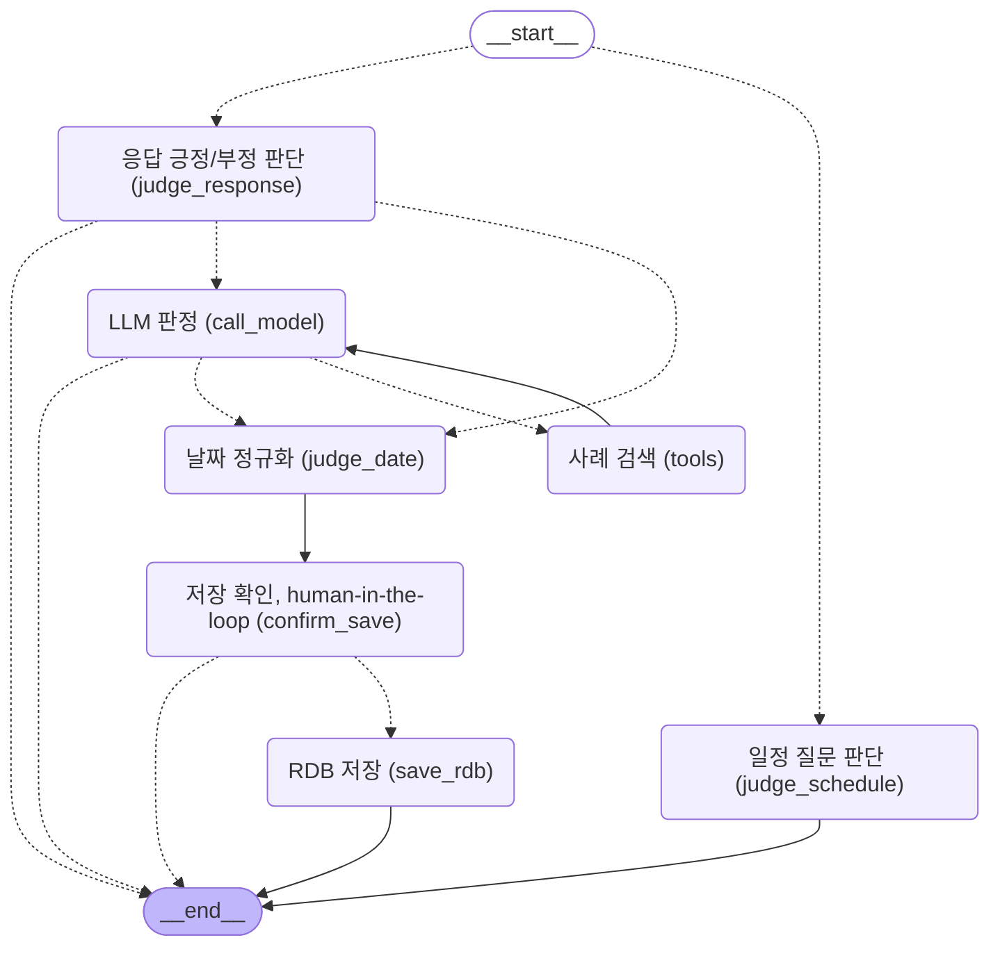

# 개인 프로젝트 개선 확장(Upgrade)

## LangGraph

- 상태(State) 하나를 두고 해당값을 바꾸면서, 워크플로우와 에이전트를 그래프 구조로 갖는 저수준 오케스트레이션 프레임워크입니다.

### 공식 예시 코드

- [공식 문서 내 예시 코드 바로가기](https://docs.langchain.com/oss/python/langgraph/overview#install)

```python
from langgraph.graph import StateGraph, MessagesState, START, END

def mock_llm(state: MessagesState):
    return {"messages": [{"role": "ai", "content": "hello world"}]}

graph = StateGraph(MessagesState)
graph.add_node(mock_llm)
graph.add_edge(START, "mock_llm")
graph.add_edge("mock_llm", END)
graph = graph.compile()

result = graph.invoke({"messages": [{"role": "user", "content": "hi!"}]})
print(result)
```

1. 객체 생성 및 State 등록
   - `graph = StateGraph(MessagesState)` StateGraph 객체를 선언하여 graph에 할당합니다. 이 시점에는 State의 스키마가 등록됩니다. (invoke 실행 단계에서 노드 사이를 오가면서 값이 생성 및 변경됩니다.) MessagesState, AgentState는 이 State의 스키마(타입)을 표현합니다. MessagesState로 만들면 LangGraph가 미리 만들어둔 상태값(Prebuilt)로 스키마가 표현되고, AgentState로 만들면 스키마를 직접 정의할 수 있습니다.

2. 노드/엣지로 그래프 설계
   - `graph.add_node(mock_llm)` StateGraph의 add_node 메서드를 호출합니다. add_node는 노드를 추가하는 메서드로 입력받은 mock_llm 함수를 등록합니다. 나중에 invoke 단계에서 mock_llm 노드에 도달하면 mock_llm 함수가 실행됩니다.
   - `graph.add_edge(START, "mock_llm")` 시작점에서 mock_llm 노드로 연결하는 엣지를 구성합니다.
   - `graph.add_edge("mock_llm", END)` mock_llm 노드에서 도착점으로 연결하는 엣지를 구성합니다.

3. 그래프 객체 생성
   - `graph.complie()` 실행 가능한 그래프 객체를 생성합니다.

4. 그래프 실행
   - `graph.invoke(...)` 초기 State를 넣어서 그래프를 실행합니다. 앞서 등록한 State가 생성되고 초기값이 할당되고, mock_llm Node가 동작합니다.

5. 실행 결과
   - result는 `graph.invoke`가 실제로 실행된 후 결과가 할당됩니다.
   - `print(result)`: 결과는 messages에 리스트로 저장되어 있는 딕셔너리입니다. HumanMessage, AIMessage가 순서대로 들어있습니다. invoke 실행 과정을 돌이켜보면, 입력으로 받은 HumanMessage는 초기 State 값입니다. 그래서 먼저 리스트에 들어갑니다. 이후, 워크플로우를 타면서 node로 만들어진 mock_llm이 실행되고, AIMessage가 리스트에 append 방식으로 누적됩니다(reducer가 병합 규칙을 정의)

## 그래프 시각화 결과



## 테스트 케이스

- 케이스 1 - 일정 질문 X - 즉시 END
- 케이스 2 - 일정 질문 O, 긍정 응답, 날짜 O, 저장 승인 - judge_date, save_rdb 진행
- 케이스 3 - 일정 질문 O, 긍정 응답, 날짜 O, 저장 거부 - END
- 케이스 4 - 일정 질문 O, 긍정 응답, 날짜 X, 저장 승인 - judge_date, save_rdb 진행
- 케이스 5 - 일정 질문 O, 긍정 응답, 날짜 X, 저장 거부 - END
- 케이스 6 - 일정 질문 O, 애매한 응답(긍정으로 추론 가능), 날짜 O, 저장 승인 - saved_rdb 진행
- 케이스 7 - 일정 질문 O, 애매한 응답(긍정으로 추론 가능), 날짜 O, 저장 거부 - END
- 케이스 8 - 일정 질문 O, 부정 응답 - END
- 케이스 9 - 일정 질문 O, 애매한 응답(부정으로 추론 가능) - END
- 케이스 10 - 일정 질문 O, 애매한 응답(추론 불가능) - END

## DB

- 개발자가 DB에 접근하는 방법은 직접 접근, 간접 접근 두 가지로 분류.
  - 직접 접근: driver 라이브러리. SQL 문자열을 직접 작성해서 접근 (테이블과 클래스 매핑 없음).
    - sqlite3: 동기 방식 driver.
    - aiosqlite: 비동기 방식 driver.
  - 간접 접근: ORM (Object-Relational Mapping, 객체-관계 매핑) 라이브러리. Python 클래스로 테이블을 정의하여 SQL 직접 작성 없이 접근.
    - SQLAlchemy: 내부적으로 sqlite3, aiosqlite, psycopg를 호출하여 동기/비동기 방식 모두 가능.
  - 스키마 (schema) 변경 관리.
    - driver 방식: CREATE TABLE, ALTER TABLE 등 SQL 문을 직접 작성해서 관리.
    - ORM 방식: Alembic 같은 migration (마이그레이션) 도구를 사용해, 하나의 DB에 대한 스키마 변경 이력을 버전 단위로 기록하고 여러 환경(로컬/서버)에 순서대로 적용.
